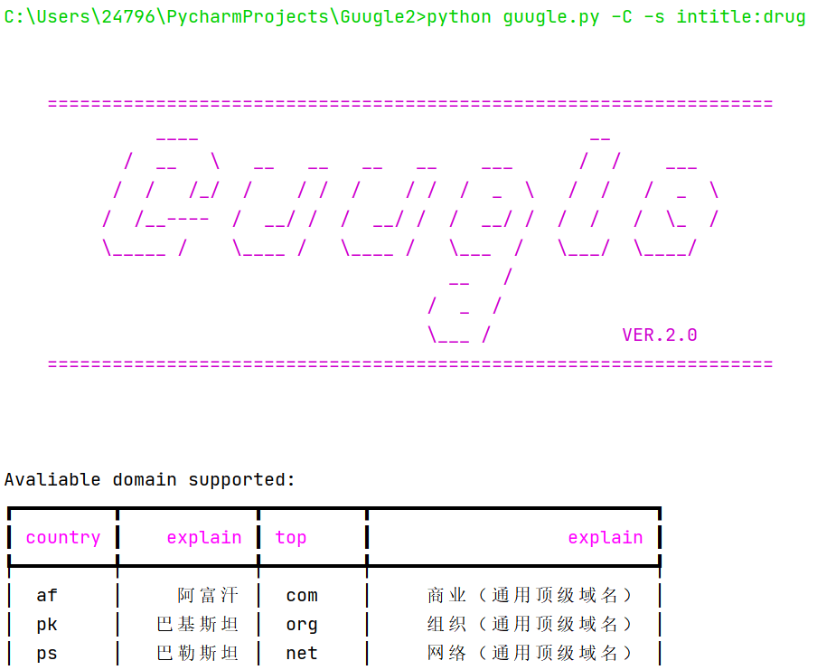
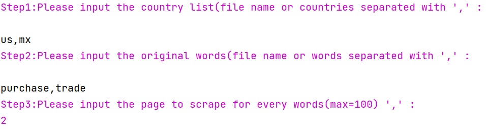
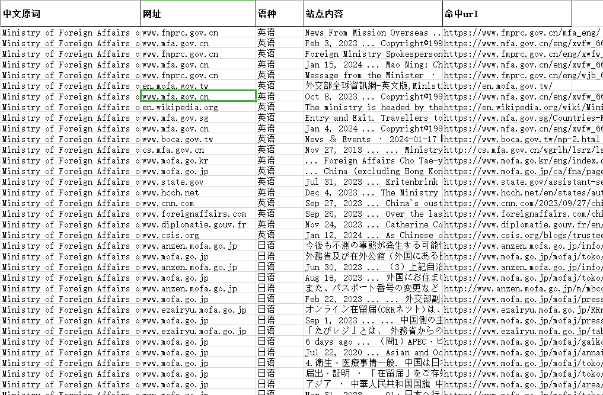

Guugle
===================================================================
              ____                                    __            
           /  __   \   __   __   __   __    ___      /  /    ___
          /  /   /_/  /    / /  /    / /  /  _  \   /  /   /  _  \
         /  /__----  /  __/ /  /  __/ /  /  __/ /  /  /   /  \_  /
         \_____ /    \____ /   \____ /   \___  /   \___/  \____/
                                         __   /
                                       /  _  /
                                       \___ /            VER.2.0
网上没有批量利用谷歌api和googlehacking语法的工具。最近因为工作需要，把以前的脚本整合了一下，变成了这个样子(●'◡'●)
## INTRO
guugle是一个利用谷歌api和有道翻译api在谷歌搜索引擎上进行批量搜索的工具，并将结果保存为适合中国宝宝体质的文件形式。
目前有三个功能：
    1.输入任意语言类型，输出根据不同语种爬取的内容
    2.输入任意国家，输出根据不同国家(政府和新闻网站居多)爬取的内容
    3.自由模式，任意批量输入googlehacking语法(不输入任何参数即可进入)
## INSTALLLATION
pip install -r requirements.txt
## USE
### 1.在keys.csv中保存谷歌的api和搜索引擎cx
(获取方法详阅https://zhuanlan.zhihu.com/p/174666017)
每个账户可以申请一个。
#### Q:如何获得大量的谷歌账号？
A:在一些群组里找商家购买，我是一块钱一个买的，买了30个基本就够用了。渠道大家各显神通吧，很好找。
### 2.在trans_secret中保存有道翻译API的key和密码
如果不使用多语言模式，就不需要
有道翻译api注册送额度，基本用不完(2024.01)，很适合中国宝宝体质
### 3.启动
### python3 guugle.py
    -h --help 提示页面
    -L --lang 多语言模式
    -Ld --direct 多语言模式(跳过翻译过程)
    -C --country 多国家/地区模式
    -a 显示谷歌api当日剩余额度
    -s --syntax 手动输入googlehacking语法
    -i --info 显示当前api信息

    for example:

    python guugle.py -C -s intitle:drug

### 4.注意事项：
谷歌api每天每个账户有100条搜索次数的限制。因此尽量提供更多key和cx为宜
### 结果示例

### 持续更新中...
#### 待更新内容
    接入智谱api实现信息解释和自动筛选
    针对单一网站的全方位自动搜索功能
    其它。欢迎交流
    ......
